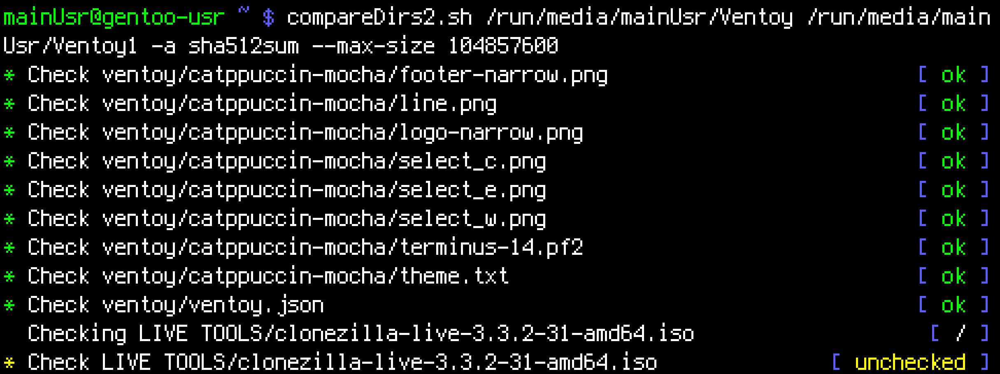

# compare_dirs.sh

A recursive directory comparison tool for Bash, styled after **OpenRC**'s
service-status output (`* Checking foo ... [ ok ]`).

It walks every file in `DIR1` and checks whether an identical file exists at
the same relative path in `DIR2` — either byte-for-byte (`cmp`) or by hash — 
with a live spinner, color-coded results, and optional rename detection. <br>
screenshot:
    

## Features

- **OpenRC-style** status lines with a spinning cursor (`/ - \ |`) while a file
  is being checked.
- Byte-for-byte comparison by default (`cmp`), or hash-based comparison
  (`md5sum`, `sha1sum`, `sha256sum`, `sha512sum`, `b2sum`).
- Size thresholds to control *when* hashing is used, falling back to `cmp`
  outside the given range.
- Rename/move detection: if a file is missing at the expected path, search
  the whole destination tree for a file with matching content/hash.
- Adaptive layout: status text wraps to a second (indented) line or the
  filename is truncated, depending on the current terminal width — updates
  live if you resize the terminal.
- Clean `Ctrl+C` / `Ctrl+Z` handling: the current and all remaining files are
  reported as `[ unchecked ]` instead of leaving a half-drawn spinner line.
- A short summary (OK / errors / unchecked) at the end of the run.

## Requirements

- Bash 4+ (uses `mapfile`)
- Standard coreutils: `cmp`, `stat`, `tput`, `find`
- If using `-x/--hash`: the corresponding hash utility (`sha256sum` etc.)
  must be installed

## Installation

```bash
chmod +x compare_dirs.sh
```

Optionally move it somewhere on your `$PATH`:

```bash
doas cp compare_dirs.sh /usr/local/bin/compare_dirs
```

## Usage

```
compare_dirs.sh [OPTIONS] DIR1 DIR2
```

| Option                | Description                                                                                          |
|------------------------|-------------------------------------------------------------------------------------------------------|
| `-x`, `--hash`         | Compare files by hash instead of byte-for-byte `cmp`.                                                |
| `-a`, `--algo ALGO`    | Hash algorithm to use: `md5sum`, `sha1sum`, `sha256sum`, `sha512sum`, `b2sum` (default: `sha256sum`). |
| `--min-size BYTES`     | Only hash files `>= BYTES`; smaller files are compared with `cmp` instead.                            |
| `--max-size BYTES`     | Only hash files `<= BYTES`; larger files are compared with `cmp` instead.                             |
| `-r`, `--find-renamed` | If a file is missing at its expected path in `DIR2`, search the entire `DIR2` tree for a file with identical content/hash (detects renames or moves). |
| `-h`, `--help`         | Show usage and exit.                                                                                  |

`DIR1` is treated as the source of truth; every file found under it is
looked for under `DIR2` at the same relative path.

## Examples

Basic byte-for-byte comparison:

```bash
./compare_dirs.sh /mnt/backup/old /mnt/backup/new
```

Hash-based comparison with SHA-512:

```bash
./compare_dirs.sh -x -a sha512sum /mnt/backup/old /mnt/backup/new
```

Hash only files between 1 MiB and 500 MiB; everything else falls back to
`cmp` (useful when hashing huge files would be too slow, or tiny files
aren't worth the overhead):

```bash
./compare_dirs.sh -x --min-size 1048576 --max-size 524288000 DIR1 DIR2
```

Detect files that were renamed or moved instead of being reported missing:

```bash
./compare_dirs.sh -x -r DIR1 DIR2
```

## Output legend

| Status         | Color  | Meaning                                                              |
|----------------|--------|-----------------------------------------------------------------------|
| `[ / - \ \| ]`  | white  | File is currently being checked (spinner animation).                 |
| `[ ok ]`       | green  | File matches (byte-for-byte or by hash).                             |
| `[ !! ]`       | red    | File differs, is missing, or was not found anywhere in `DIR2`.       |
| `[ finding ]`* | cyan   | Searching `DIR2` for a renamed/moved match (`-r`, spinner animation). |
| `[ found ]`    | green  | A renamed/moved match was located; its path is printed below.        |
| `[ unchecked ]`| yellow/orange | File was not checked yet — printed on `Ctrl+C` / `Ctrl+Z`.    |

\* shown as the "Find `<file>`" label with an animated spinner, colored cyan.

Every completed line is prefixed with `*`, matching OpenRC's convention for
finished service actions; in-progress lines have no prefix.

### Long file names / narrow terminals

The status line adapts to the current terminal width:

1. If the full line (name + status) fits — it's printed on one line, as
   normal.
2. If the name alone fits but the status wouldn't — the status is wrapped
   to an indented line below the name.
3. If even the name doesn't fit — it's truncated from the front
   (`...end_of_path.txt`) and kept on one line.

Resizing the terminal mid-run updates this behavior on the fly.

## Interruption (Ctrl+C / Ctrl+Z)

Pressing `Ctrl+C` or `Ctrl+Z` stops the spinner, marks the file currently
being checked (and every file not yet reached) as `[ unchecked ]` in
orange/yellow, and prints a final summary before exiting with status `130`.

## Exit codes

| Code  | Meaning                                  |
|-------|-------------------------------------------|
| `0`   | Comparison finished (see summary for results/errors count). |
| `1`   | Bad arguments, missing directory, or unsupported/missing hash tool. |
| `130` | Interrupted by `Ctrl+C` / `Ctrl+Z`.       |

## Notes / limitations

- Only regular files under `DIR1` are compared; the script does not detect
  files that exist in `DIR2` but not in `DIR1`.
- `-r/--find-renamed` performs a linear scan of `DIR2` for every missing
  file, so it can be slow on very large trees.
- Symlinks, permissions, timestamps, and ownership are **not** compared —
  only file content.
